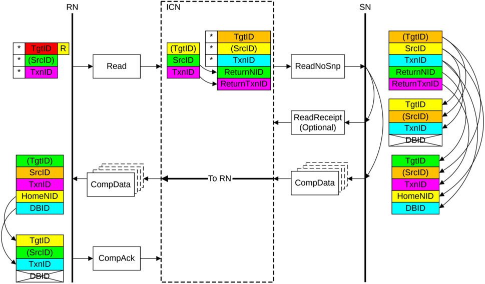

### B2.5.1.1 ID value transfer with DMT

Figure B2.23 shows how the Target and Transaction ID values in the DMT transaction messages are derived. For example, the value of SrcID in the ReadNoSnp request from the interconnect is assigned by the interconnect. Whereas the ReturnNID, used as TgtID in the Data response, is set to the value of SrcID of the received Read request.

Figure B2.23: ID value transfer in a DMT transaction

The required steps in the flow that Figure B2.23 shows are:

1. The Requester starts the transaction by sending a Request packet. The identifier fields of the request are generated as follows:

    - The TgtID is determined by the destination of the Request.

        > **_NOTE:_** The TgtID field can be remapped to a different value by the interconnect.

    - The SrcID is a fixed value for the Requester.
    - The Requester generates a TxnID field that is unique for that Requester.

2. The recipient Home Node in the interconnect generates a Request to the Subordinate Node. The identifier fields of the request are generated as follows:

    - The TgtID is set to the value required for the Subordinate.
    - The SrcID is a fixed value for the Home.