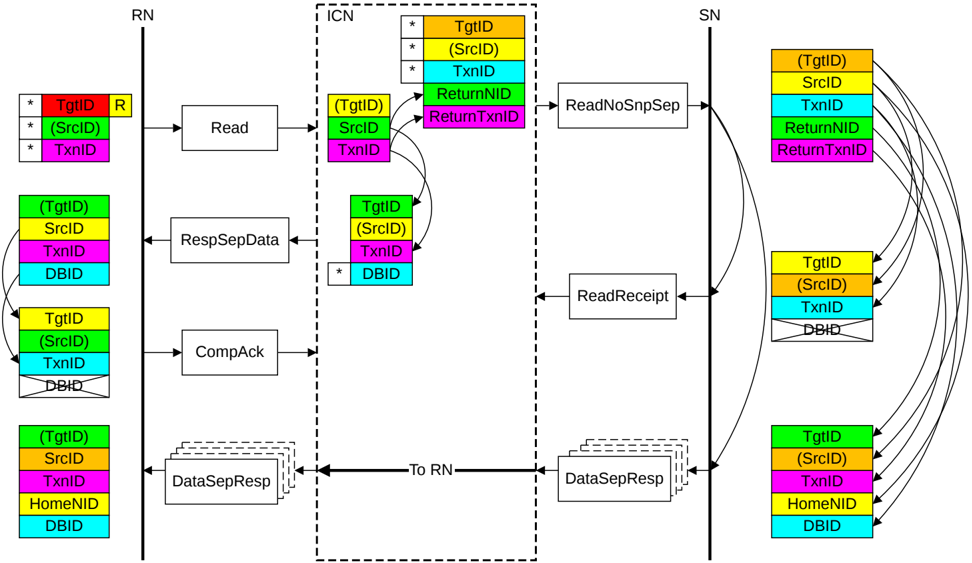

Figure B2.24: ID value transfer in a DMT transaction with separate Comp and Data

The required steps in the flow that Figure B2.24 shows are:

1. The Requester starts the transaction by sending a Request packet.

    The identifier fields of the request are generated as follows:

    - The TgtID is determined by the destination of the Request.

        > **_NOTE:_** The TgtID field can be remapped to a different value by the interconnect.

    - The SrcID is a fixed value for the Requester.
    - The Requester generates a TxnID field that is unique for that Requester.

2. The recipient Home Node in the interconnect generates a request to the Subordinate Node.

    The identifier fields of the request are generated as follows:

    - The TgtID is set to the value required for the Subordinate.
    - The SrcID is a fixed value for the Home.
    - The TxnID is a unique value generated by the Home.
    - The ReturnNID is set to the same value as the SrcID of the original request.
    - The ReturnTxnID is set to the same value as the TxnID of the original request.

3. The recipient Home Node in the interconnect provides the separate Read response.

    The identifier fields of the read response are generated as follows: