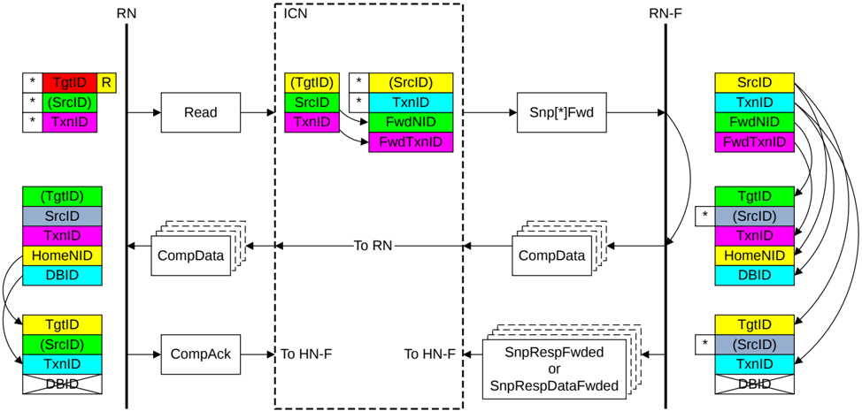

Figure B2.25: ID value transfer in a DCT transaction

The required steps in the flow that Figure B2.25 shows are:

1. The Requester starts the transaction by sending a Request packet.

    The identifier fields of the request are generated as follows:

    - The TgtID is determined by the destination of the Request.

        > **_NOTE:_** The TgtID field can be remapped to a different value by the interconnect.

    - The SrcID is a fixed value for the Requester.
    - The Requester generates a TxnID field that is unique for that Requester.

2. The recipient Home Node in the interconnect generates a Forwarding snoop to the RN-F node.

    The identifier fields of the snoop are generated as follows:

    - The SrcID is a fixed value for the Home.
    - The TxnID is a unique value generated by the Home.
    - The FwdNID is set to the same value as the SrcID of the original request.
    - The FwdTxnID is set to the same value as the TxnID of the original request.

3. The RN-F provides the read data.

    The identifier fields of the Read data response are generated as follows:

    - The TgtID is set to the same value as the FwdNID of the snoop.
    - The SrcID is a fixed value for the RN-F.
    - The TxnID is set to the same value as the FwdTxnID of the snoop.
    - The HomeNID is set to the same value as the SrcID of the snoop.