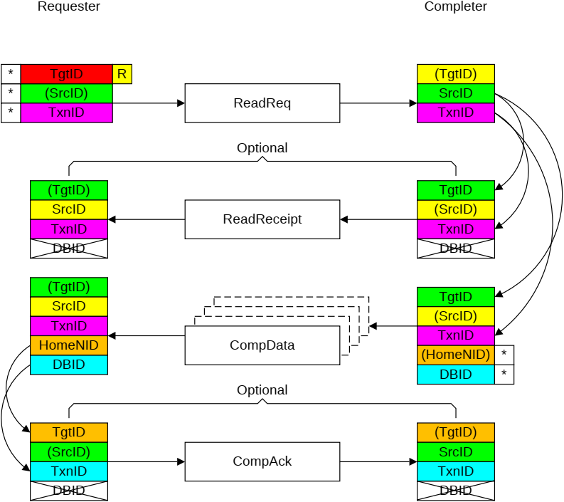

Figure B2.26: ID value transfer in a Read request with ReadReceipt and CompAck

The required steps in the flow that Figure 2-26 shows are:

1. The Requester starts the transaction by sending a Request packet.

    The identifier fields of the request are generated as follows:

    - The TgtID is determined by the destination of the Request.

        > **_NOTE:_** The TgtID field can be re-mapped to a different value by the interconnect.

    - The SrcID is a fixed value for the Requester.
    - The Requester generates a TxnID field that is unique for that Requester.

2. If the transaction includes a ReadReceipt, the Completer receives the Request packet and provides the read receipt.

    The identifier fields of the ReadReceipt response are generated as follows:

    - The TgtID is set to the same value as the SrcID of the request.
    - The SrcID is a fixed value for the Completer. This also matches the TgtID received.
    - The TxnID is set to the same value as the TxnID of the request.
    - The DBID field is not valid.

3. The Completer receives the Request packet and provides the read data.

    The identifier fields of the read data response are generated as follows:

    - The TgtID is set to the same value as the SrcID of the request.