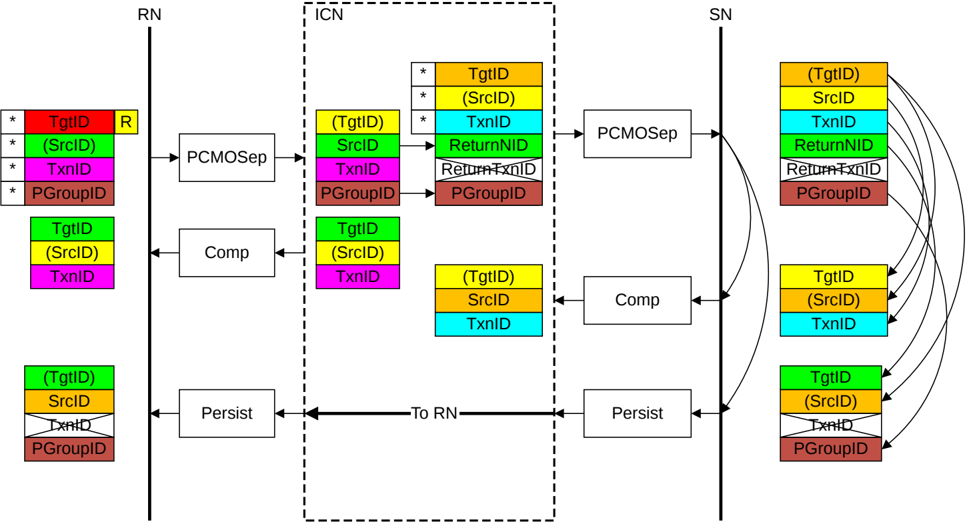

Figure B2.27: ID value transfer in a CleanSharedPersistSep transaction

The required steps in the flow that Figure B2.27 shows are:

1. The Requester starts the transaction by sending a Request packet.

    The identifier fields of the Request are generated as follows:

    - The TgtID is determined by the destination of the Request.

        > **_NOTE:_** The TgtID field can be remapped to a different value by the interconnect.

    - The SrcID is a fixed value for the Requester.
    - The Requester generates a TxnID value that is unique for that Requester.

    The TxnID value can be reused by the Requester after receiving the Comp response.

    - The Requester generates a new PGroupID value, or reuses a PGroupID value currently in use.

2. The recipient Home Node in the interconnect generates a request to the Subordinate.

    The identifier fields of the request to the Subordinate Node are generated as follows:

    - The TgtID is set to the value required for the Subordinate.
    - The SrcID is a fixed value for the Home.
    - The TxnID is a unique value generated by the Home.

    The TxnID value can be reused by the Home after receiving the Comp response.

    - The ReturnNID is set to the same value as the SrcID of the original request.
    - The ReturnTxnID is inapplicable and must be set to 0.