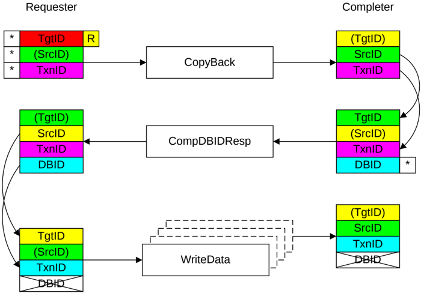

### B2.5.3 Write transactions

This section describes the use of TxnID and DBID fields for Write transactions:

- B2.5.3.1 CopyBack
- B2.5.3.2 WriteNoSnp transaction
- B2.5.3.3 WriteUnique transaction
- B2.5.3.4 StashOnce or StashOnceSep transaction

#### B2.5.3.1 CopyBack

This section describes the use of the identifier fields for a CopyBack transaction.

Figure B2.28 shows the identifier value transfer.

Figure B2.28: ID value transfer in a CopyBack

The required steps in the flow that Figure B2.28 shows are:

1. The Requester starts the transaction by sending a Request packet.

    The identifier fields of the request are generated as follows:

    - The TgtID is determined by the destination of the Request.

        > **_NOTE:_** The TgtID field can be remapped to a different value by the interconnect.

    - The SrcID is a fixed value for the Requester.
    - The Requester generates a unique TxnID field.

2. The Completer receives the Request packet and generates a CompDBIDResp response.

    The identifier fields of the response are generated as follows: