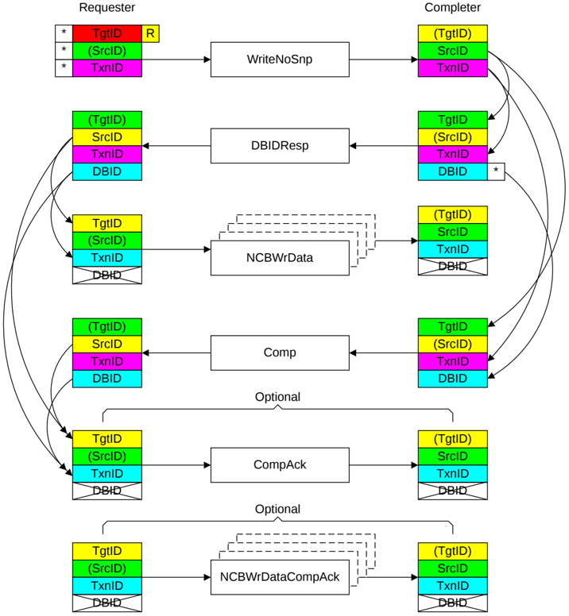

Figure B2.29: ID value transfer in a WriteNoSnp

The uses of the identifier fields are the same as for a transaction with a combined response with the additional requirements that:

- The identifier fields used for the separate DBIDResp and Comp responses must be identical.
- The TxnID value must only be reused by a Requester when both the DBIDResp and Comp responses have been received.

The required steps in the flow that Figure B2.29 shows are:

1. The Requester starts the transaction by sending a Request packet.

    The identifier fields of the request are generated as follows:

    - The TgtID is determined by the destination of the Request.

        > **_NOTE:_** The TgtID field can be remapped to a different value by the interconnect.

    - The SrcID is a fixed value for the Requester.