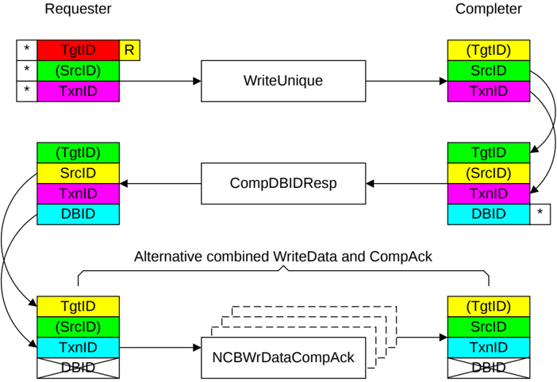

Figure B2.31: ID value transfer with a combined WriteData and CompAck response

#### B2.5.3.4 StashOnce or StashOnceSep transaction

This section describes the use of the identifier fields for a StashOnce or StashOnceSep transaction with DataPull.

Figure B2.32 shows the identifier value transfer.