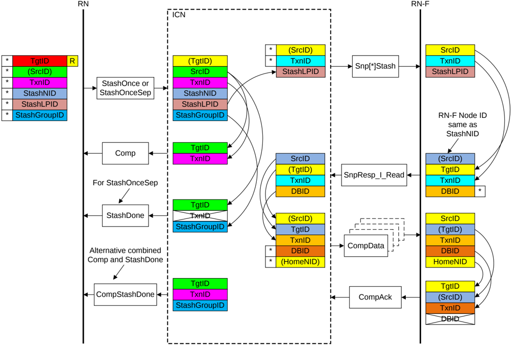

Figure B2.32: ID value transfer in a Stash transaction

The required steps in the flow that Figure B2.32 shows are:

1. The Requester starts the transaction by sending a Stash request packet.

    The identifier fields of the request are generated as follows:

    - The TgtID is determined by the destination of the Request.

        > **_NOTE:_** The TgtID field can be remapped to a different value by the interconnect.

    - The SrcID is a fixed value for the Requester.
    - The Requester generates a TxnID field that is unique for that Requester.
    - The Requester includes the StashNID field to indicate to which RN-F to send the Stash.
    - The Requester includes the StashLPID field to indicate the LP within the RN-F.

2. The Home Node in the interconnect receives the Stash request packet and sends the Comp response to the Request Node.

    The identifier fields of the Comp response are generated as follows:

    - The TgtID is set to the same value as the SrcID of the request.
    - The TxnID is set to the same value as the TxnID of the request.