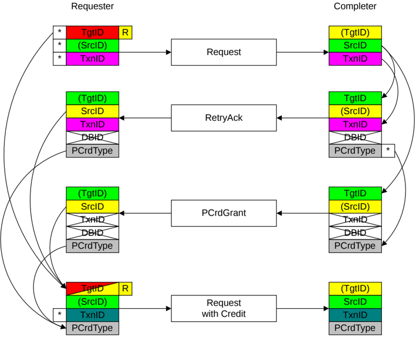

    - The SrcID is a fixed value for the RN-F. This also matches the TgtID received.
    - The TxnID is set to the same value as the DBID of the read data.
    - The DBID field is not valid.

### B2.5.4 DVMOp transaction

The use of TgtID, SrcID, TxnID, and DBID identifier fields for a DVMOp transaction is identical to those in the B2.5.3.2 WriteNoSnp transaction.

### B2.5.5 Transaction requests with Retry

For transactions that receive a RetryAck response, there are specific rules on how the identifier fields are used.

See B2.9 Request Retry, for more details on the Retry mechanism, and B2.5.6 Protocol Credit Return transaction for rules about the return of unused credits.

Figure B2.33 shows the identifier value transfer.

Figure B2.33: ID value transfer in a transaction request with retry

The required steps in the flow that Figure B2.33 shows are:

1. The Requester starts the transaction by sending a Request packet. The identifier fields of the request are generated as follows:

    - The TgtID is determined by the destination of the Request.