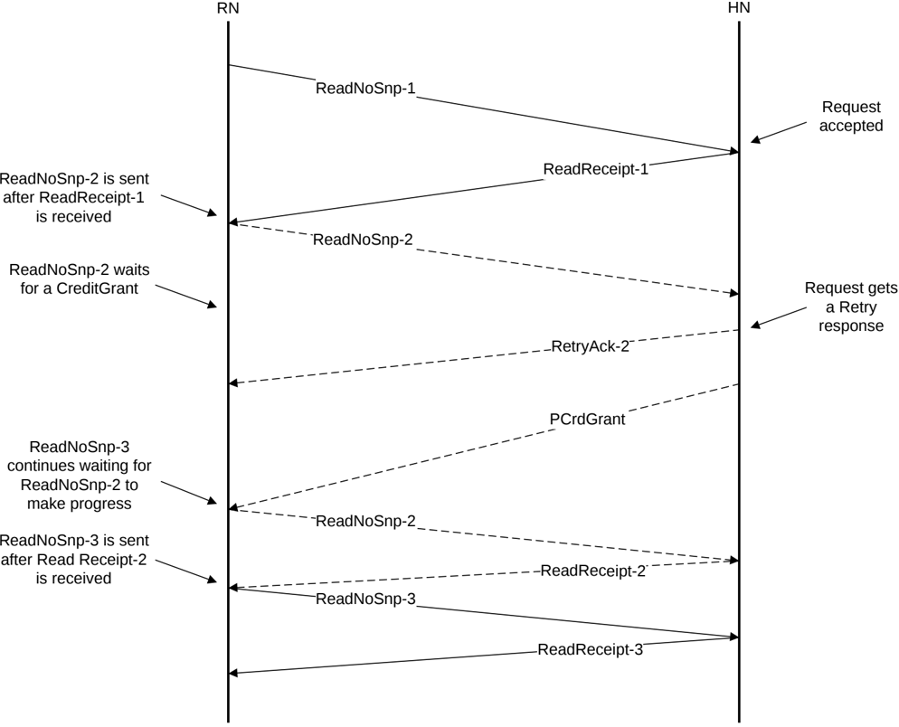

All architectural mechanisms applicable to increasing streaming efficiency and corresponding constraints are defined in B2.6.5.3 Streaming Ordered Write transactions.

When a ReadNoSnp or ReadNoSnpSep has the Order field set to 0b01, a ReadReceipt response from the Completer guarantees that the Completer has accepted the request and does not send a RetryAck response.

##### B2.6.5.1.1 Read Request order example

Figure B2.34 shows the request ordering of three Read requests.

Figure B2.34: Series of ordered Read requests

Three ordered requests are sent from Request Node to Home Node in Figure B2.34 as follows:

1. The Request Node sends the ReadNoSnp-1 request to the Home Node.
2. The Home Node accepts the request and returns the ReadReceipt-1 response to the Request Node.
3. After the ReadReceipt-1 response is received, the Request Node sends the ReadNoSnp-2 request to the Home Node.