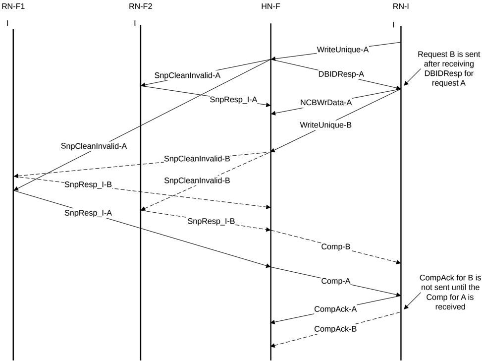

Figure B2.35: Streaming Ordered WriteUnique transactions flow

The Streaming Ordered WriteUnique transaction flow is as follows:

1. RN-I issues WriteUnique-A to the Home.
2. The Home responds with DBIDResp and issues SnpCleanInvalid-A to RN-F1 and RN-F2.
3. RN-I sends the write data associated with WriteUnique-A and issues the next ordered WriteUnique request to the Home, shown in Figure B2.35 as WriteUnique-B.
4. WriteUnique-A and WriteUnique-B are to different addresses. The Home sends out SnpCleanInvalid-B snoops to RN-F1 and RN-F2 for WriteUnique-B without waiting for responses for WriteUnique-A transaction snoops.
5. The Snoop responses for the WriteUnique-B transaction are received by the Home before the Snoop responses for the WriteUnique-A transaction are received. Home sends Comp to RN-I for the WriteUnique-B transaction.
6. The Home waits for Snoop responses for the WriteUnique-A transaction to be received. Once received, the Home can send Comp to RN-I for the WriteUnique-A transaction.
7. The Requester, RN-I, receives Comp-B and waits to receive Comp-A before proceeding with the next response.