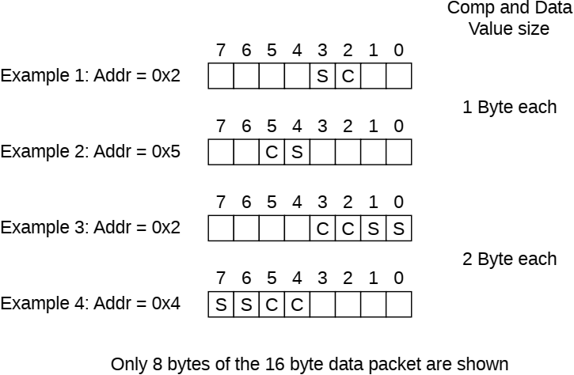

Figure B2.36: Data value packing for AtomicCompare transaction

In Figure B2.36, Example 1 shows the addressed byte location is 0x2 and the total size of data is 2 bytes. In this case, the Compare and Swap data must be placed in an address location aligned to a 2-byte boundary that includes the addressed location, that is, addresses 0x2 to 0x3. Compare data is placed in location 0x2 and Swap data is placed in location 0x3.

> **_NOTE:_**  The address of the Swap data can be determined by inverting bit[0] of the Compare data address. Bit[0] is inverted because the size of the Compare data and the size of the Swap data is 1 byte.

In Figure B2.36, Example 3 shows the addressed location is 0x2 and the total size of data is 4 bytes. In this case, the Compare and Swap data must be placed in an address location aligned to a 4-byte boundary that includes the addressed location, that is, addresses 0x0 to 0x3. Compare data is placed in location 0x2 and Swap data is placed in location 0x0.

> **_NOTE:_** The address of the Swap data can be determined by inverting bit[1] of the Compare data address. Bit[1] is inverted because the size of the Compare data and the size of the Swap data is 2 bytes.

#### B2.8.5.3 Endianness

The data on which an atomic operation executes can be in either little-endian or big-endian format. For arithmetic operations, such as ADD, MAX, and MIN, the component performing the operation needs to know the format of the data.

The endian format of the data is defined by the Endian bit in the Atomic transaction Request packet. See B13.10.32 Endian.

### B2.8.6 Critical Chunk Identifier

The CCID field is used to identify the data bytes that are the most critical in the transaction request.

The CCID field must match the value of Addr[5:4] of the original request. Transactions which contain multiple data packets must use the same CCID value for all data packets.