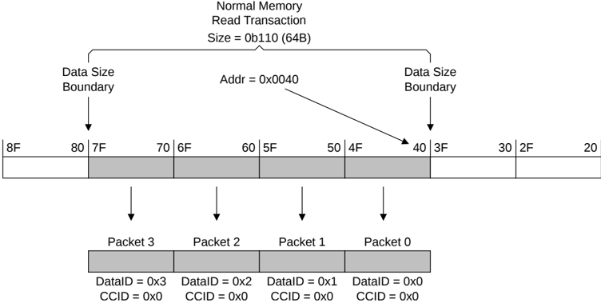

> **_NOTE:_** Critical chunk first wrap order ensures that interfacing to protocols that do not support data reordering, such as AXI, can be done in the most efficient manner when an ordered interconnect is used.

Wrap order is defined as follows:

Start\_Address = Addr Number\_Bytes = 2 Size INT(x) = Rounded down integer value of x Aligned\_Address = (INT(Start\_Address / Number\_Bytes)) x Number\_Bytes Lower\_Wrap\_Boundary = Aligned\_Address Upper\_Wrap\_Boundary = Aligned\_Address + Number\_Bytes - 1

To maintain wrap order, the order must be:

1. The first data packet must correspond to the data bytes specified by the Start\_Address of the transaction.
2. Subsequent packets must correspond to incrementing byte addresses up to the Upper\_Wrap\_Boundary.
3. Subsequent packets must correspond to the Lower\_Wrap\_Boundary.
4. Subsequent packets must correspond to incrementing byte addresses up to the Start\_Address.

> **_NOTE:_** Some of the steps to maintain wrap order could overlap and not be required if the required bytes are included in a previous step.

### B2.8.9 Data transfer examples

This section gives a number of examples of the data transfer requirements.

In most of the examples, the size of the transaction is 64 bytes and the data bus width is 128 bits. This requires 4 data packets for each transaction.

In the following examples, the accompanying text highlights some interesting aspects. The examples are not intended to describe all aspects.

Figure B2.37: Normal memory 64-byte Read transaction from an aligned address

