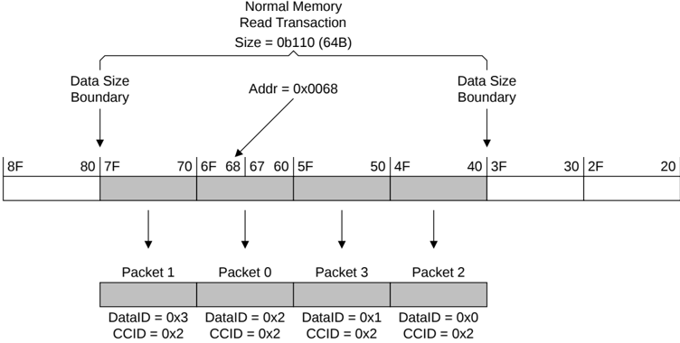
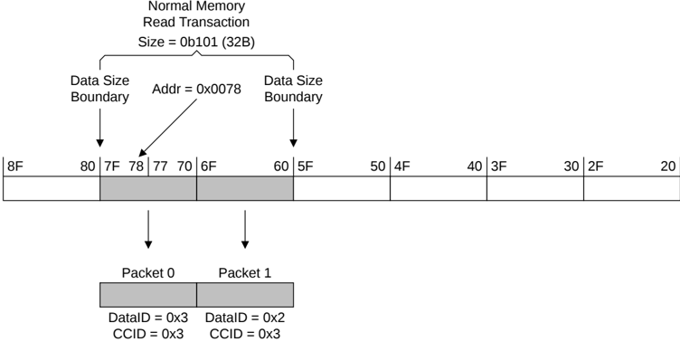

In Figure B2.37:

- The order of the data packets, as indicated by Packet 0, Packet 1, Packet 2, and Packet 3, is such that they follow wrap order.
- The DataID changes for each packet, while the CCID field remains constant.
- The packet containing the data bytes specified by the address of the transaction has the same value for the CCID and DataID fields.

Figure B2.38: Normal memory 64-byte Read transaction from an unaligned address

In Figure B2.38:

- The order of the data packets, as indicated by Packet 0, Packet 1, Packet 2, and Packet 3, is such that they follow wrap order.
- The DataID changes for each packet, while the CCID field remains constant.
- The packet containing the data bytes specified by the address of the transaction has the same value for the CCID and DataID fields.

Figure B2.39: Normal memory 32-byte Read transaction from an unaligned address

