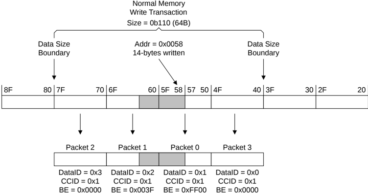
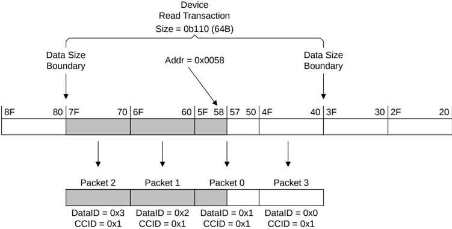

In Figure B2.39:

- The size of the transaction is 32-byte and the data bus width is 128-bit, resulting in 2 data packets.
- The order of the data packets, as indicated by Packet 0 and Packet 1, is such that they follow wrap order.

Figure B2.40: Normal memory 14-byte Read transaction from an unaligned address

In Figure B2.40:

- The order of the data packets, as indicated by Packet 0, Packet 1, Packet 2, and Packet 3, is such that they follow wrap order.
- The DataID changes for each packet, while the CCID field remains constant.
- The packet containing the data bytes specified by the address of the transaction has the same value for the CCID and DataID fields.
- Fourteen consecutive bytes in memory are written, as indicated by the BE bits. However, other combinations of BE bits are permitted. See B2.8.3 Byte Enables.

Figure B2.41: Device Read transaction from an unaligned address

