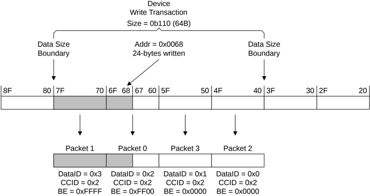

In Figure B2.41:

- The shaded area indicates the valid bytes in the transaction. The valid bytes extend from the transaction address up to the next Size boundary.
- The transaction includes the transfer of a packet that contains no valid data.

Figure B2.42: Device Write transaction to an unaligned address

In Figure B2.42:

- BE bits are only permitted to be asserted for the bytes from the transaction address up to the next Size boundary. It is not required that all BE bits meeting this criteria are asserted.
- BE bits for bytes below the start address must not be asserted.