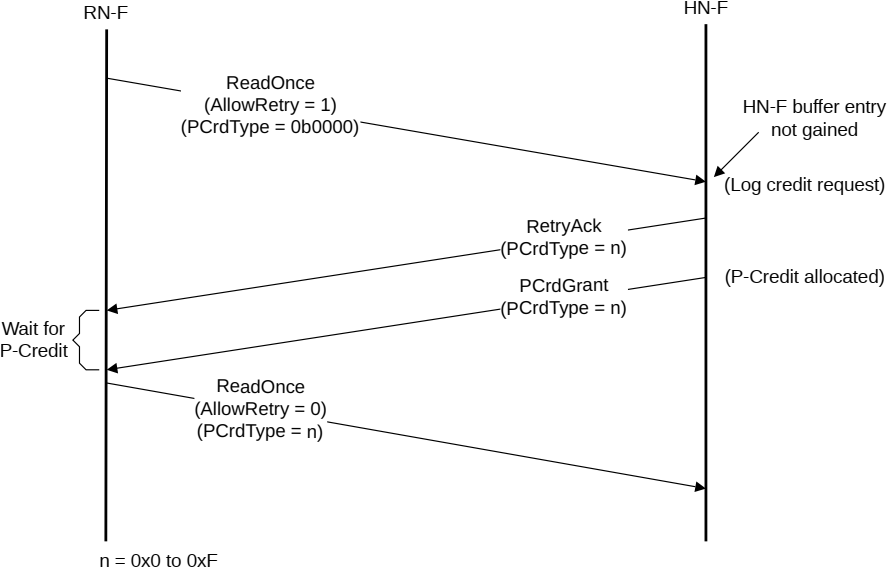

    - If the AllowRetry field is deasserted, the PCrdType field must be set to the value that was returned in the RetryAck response from the Completer when the transaction was first attempted.

- A PCrdReturn transaction must have the credit type set to the value of the credit type that is being returned. See B13.10.39 Protocol Credit Type, PCrdType for the PCrdType value encodings.
- For destinations that have a single credit class, or do not implement credit type classification, it is recommended that the PCrdType field is set to 0b0000.

> **_NOTE:_** The value a Completer assigns to PCrdType is IMPLEMENTATION DEFINED.

The Completer must implement a starvation prevention mechanism to ensure that all transactions, irrespective of QoS value or credit type required, eventually make forward progress, even if over a significantly long time period. This is done by ensuring that credits are eventually given to every transaction that has received a RetryAck response. See B11.1 Quality of Service (QoS) mechanism for more details on the distribution of credits for the purposes of QoS.

### B2.9.3 Transaction Retry flow

Figure B2.43 shows a typical Transaction Retry flow.

The steps that Figure B2.43 shows are:

1. The RN-F sends a ReadOnce request to the HN-F.
- This is done without a credit, so AllowRetry is asserted. This means PCrdType must be set to 0b0000.
2. The HN-F receives the request and sends a RetryAck response because the request is not able to gain buffer entry at the HN-F.
- The request is logged and a PCrdType is determined at the HN-F.