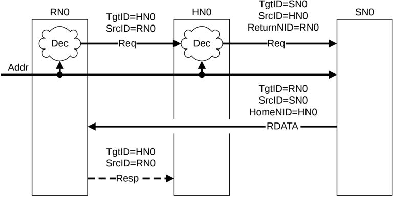

## B3.4 Network layer flow examples

This section shows transaction flows at the network layer. It contains the following sections:

- B3.4.1 Simple flow
- B3.4.2 Flow with interconnect-based SAM
- B3.4.3 Flow with interconnect-based SAM and Retry request

The following figures contain the term 'Dec' that represents the Decode.

### B3.4.1 Simple flow

Figure B3.1 is an example of a simple transaction flow and shows how the TgtID is determined for the requests and responses.

Figure B3.1: TgtID assignment without remapping

The steps for TgtID assignment without remapping in Figure B3.1 are:

1. RN0 sends a request with TgtID of HN0 using the SAM internal to RN0.

    - The interconnect does not remap the node ID.

2. HN0 looks up an internal SAM to determine the target Subordinate Node.
3. SN0 receives the request and sends a data response.

    - The data response packet has the TgtID derived from the requests ReturnNID.

4. RN0 receives the data response from SN0.
5. RN0 sends, if necessary, a CompAck response with TgtID of HN0 derived from the HomeNID in the data response packet to complete the transaction.

### B3.4.2 Flow with interconnect-based SAM

Figure B3.2 shows a case where remapping of the TgtID occurs in the interconnect.