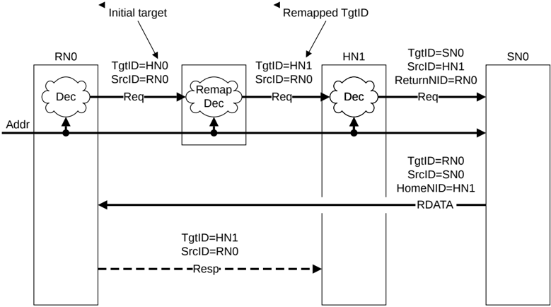

> **_NOTE:_** Only the TgtID of the request from the Request Node is remapped. The TgtID in all other packets in the transaction flow is determined in a similar manner to B3.4.1 Simple flow.

Figure B3.2: TgtID assignment with remapping logic

The steps for TgtID assignment with remapping logic in Figure B3.2 are as follows:

1. RN0 sends a Request with TgtID of HN0 using the SAM internal to RN0.
2. The interconnect remaps the request TgtID from HN0 to HN1. The SrcID remains set to the original requester, RN0.
3. HN1 looks up an internal SAM to determine the target Subordinate Node. The ReturnNID is set to match the original Requester, RN0.
4. SN0 receives the request and sends a data response.

    - The data response packet has the TgtID derived from the requests ReturnNID, with HomeNID set to match the remapped Home Node.

5. RN0 receives the data response from SN0.
6. If necessary, the RN0 sends a CompAck response with TgtID of HN1 derived from the HomeNID in the data response packet to complete the transaction.

### B3.4.3 Flow with interconnect-based SAM and Retry request

Figure B3.3 shows a case of a request getting retried.