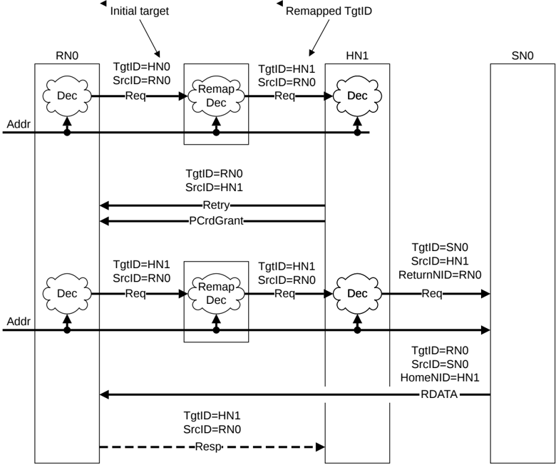

Figure B3.3: Remapping of TgtID and retried request

The steps to remap TgtID and retry the request in Figure B3.3 are as follows:

1. The interconnect remaps the TgtID provided by RN0 to HN1.
2. The request receives a RetryAck response.

    - The RetryAck and PCrdGrant responses get the TgtID information from the SrcID in the received request.

3. RN0 resends the request once both RetryAck and PCrdGrant responses are received.

    - The TgtID in the retried request is the same as the SrcID in the received RetryAck or the TgtID in the original request. The TgtID must pass through the remapping logic again.

4. The packets in the rest of the transaction flow get the TgtID in a similar manner to B3.4.2 Flow with interconnect-based SAM.