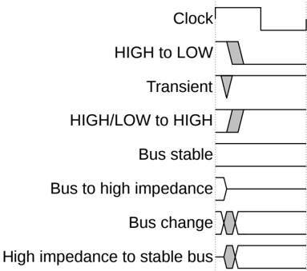

# Conventions

## Typographical conventions

The typographical conventions are:

*italic* Highlights important notes, introduces special terminology, and denotes internal cross-references and citations.

**bold** Denotes signal names, and is used for terms in descriptive lists, where appropriate.

monospace Used for assembler syntax descriptions, pseudocode, and source code examples. Also used in the main text for instruction mnemonics and for references to other items appearing in assembler syntax descriptions, pseudocode, and source code examples.

SMALL CAPITALS Used for a few terms that have specific technical meanings.

## Timing diagrams

The components used in timing diagrams are explained in Figure 1. Variations have clear labels, when they occur. Do not assume any timing information that is not explicit in the diagrams.

Shaded bus and signal areas are undefined, so the bus or signal can assume any value within the shaded area at that time. The actual level is unimportant and does not affect normal operation.

Figure 1: Key to timing diagram conventions

Timing diagrams sometimes show single-bit signals as HIGH and LOW at the same time and they look similar to the bus change shown in Figure 1 diagram conventions. If a timing diagram shows a single-bit signal in this way, then its value does not affect the accompanying description.

## Time-Space diagrams

The Figure 2 figure explains the format used to illustrate protocol flow.