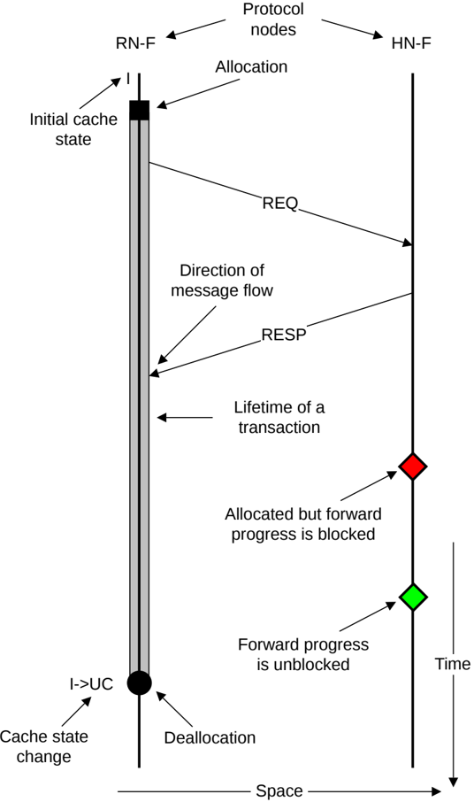

Figure 2: Key to Time-Space diagram conventions

In the Time-Space diagram:

- The protocol nodes are positioned along the horizontal axis and time is indicated vertically, top to bottom.
- The lifetime of a transaction at a protocol node is shown by an elongated shaded rectangle along the time axis from allocation to the deallocation time.
- The initial cache state at the node is shown at the top.
- The diamond shape on the timeline indicates arrival of a request and whether its processing is blocked waiting for another event to complete.
- The cache state transition, upon the occurrence of an event, is indicated by I->UC.