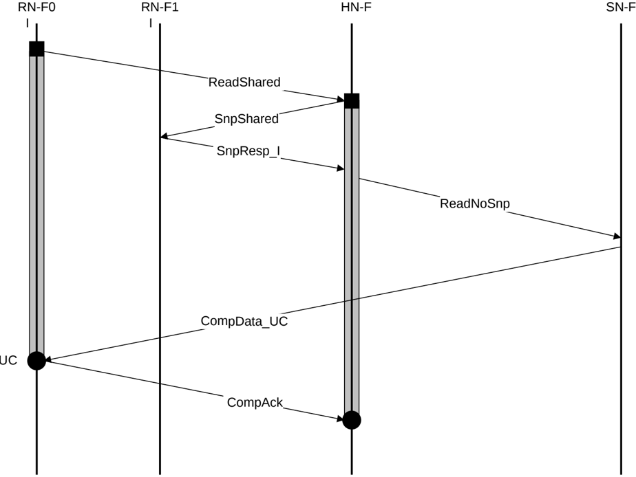

### B5.1.2 Read transaction with DMT and with snoops

For Read transactions with snoops and data from memory, DMT is recommended.

Figure B5.2 shows an example DMT transaction flow using the ReadShared transaction.

From SN-F to HN-F, a response is not required because CompAck from the Requester is used to deallocate the request at Home.

Figure B5.2: DMT Read transaction example with snoops and data from memory

The steps in the ReadShared transaction flow in Figure B5.2 are:

1. RN-F0 sends a ReadShared request to HN-F.
2. HN-F sends a SnpShared request to RN-F1. RN-F1 returns SnpResp\_I response to HN-F.
3. HN-F sends a ReadNoSnp request to SN-F after receiving the Snoop response from RN-F1. This guarantees that RN-F1 has not responded with data.
4. SN-F sends a data response directly to RN-F0, using CompData\_UC.
5. RN-F0 sends CompAck to HN-F as the request is ReadShared and requires CompAck to complete the transaction.