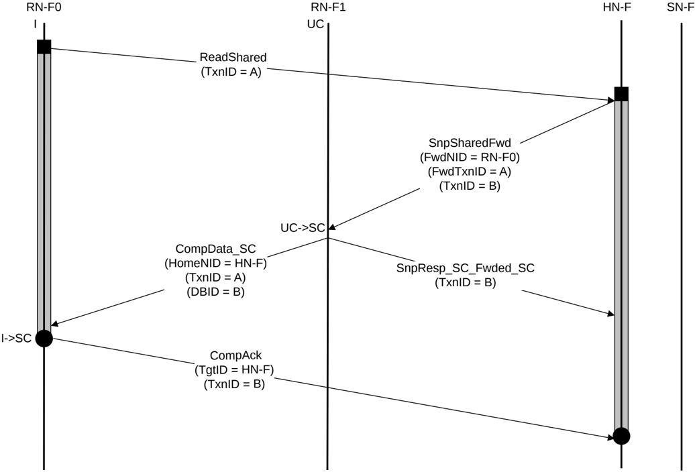

### B5.1.3 Read transaction with DCT

For Read transactions with snoops and data from other Request Node caches, Direct Cache Transfer (DCT) is recommended.

#### B5.1.3.1 DCT from cache line in UC state

Figure B5.3 shows an example flow for a DCT transaction. The Requester is RN-F0 and the forwarding cache is at RN-F1.

Figure B5.3: DCT from cache line in UC state

The steps in the DCT transaction flow in Figure B5.3 are:

1. RN-F0 sends a ReadShared request to HN-F.
2. HN-F sends a SnpSharedFwd, a Forwarding snoop request to RN-F1.
3. RN-F1 forwards CompData\_SC response to RN-F0. The TxnID is the same as the original ReadShared request.
4. RN-F1 also sends a SnpResp\_SC\_Fwded\_SC snoop response to HN-F. RN-F1 cache line state transitions from UC to SC.
5. After receiving the CompData\_SC response, RN-F0 cache line state transitions from I to SC and RN-F0 sends a CompAck response to HN-F.