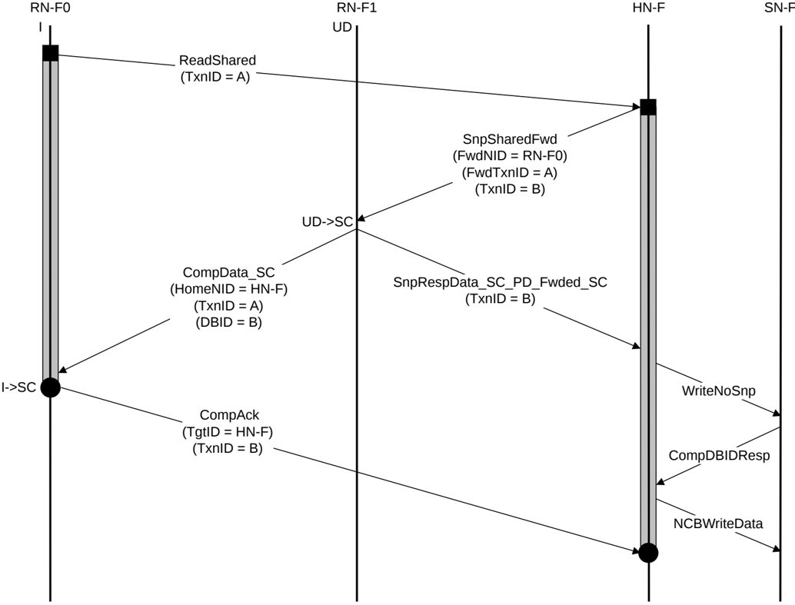

> **_NOTE:_** Steps 3 and 4 in the DCT transaction flow can occur in any order as CompData and SnpResp are sent on different channels.

#### B5.1.3.2 Double data return in a DCT transaction

Figure B5.4 shows an example DCT transaction flow that sends the data to HN-F and forwards the data to the RN-F0.

Figure B5.4: Double data return in DCT transaction

The steps in the DCT transaction flow in Figure B5.4 are:

1. RN-F0 sends a ReadShared request to HN-F.
2. HN-F sends a SnpSharedFwd Snoop request to RN-F1.
3. RN-F1 sends CompData\_SC response to RN-F0. The TxnID is the same as the original ReadShared request. RN-F0 cache line transitions from I to SC.