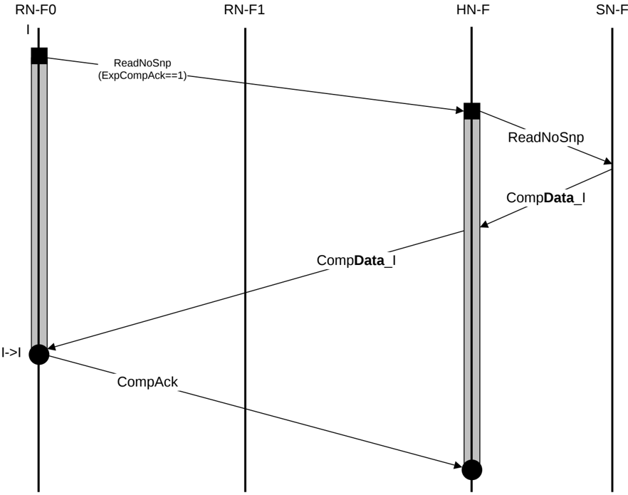

4. RN-F1 also sends a SnpRespData\_SC\_PD\_Fwded\_SC snoop response to HN-F that includes a copy of the cache line and passes responsibility for the Dirty cache line to HN-F. RN-F1 cache line transitions from UD to SC.
5. HN-F sends a WriteNoSnp request to the SN-F.
6. SN-F responds to the HN-F with CompDBIDResp to request the data.
7. HN-F sends NCBWrData to the SN-F.
8. RN-F0 sends CompAck after receiving the Data response.

### B5.1.4 Read transaction without DMT or DCT

Figure B5.5 shows an example of the flow without DMT using the ReadNoSnp transaction. In Figure B5.5, the ReadNoSnp has the ExpCompAck set in the original request.

The request does not generate any snoops and receives the data from a response to a memory read by the HN-F.

Figure B5.5: ReadNoSnp transaction flow

The steps in the ReadNoSnp transaction flow in Figure B5.5 are:

1. RN-F0 issues a ReadNoSnp transaction, with ExpCompAck set to 1.
2. HN-F receives and allocates the request.