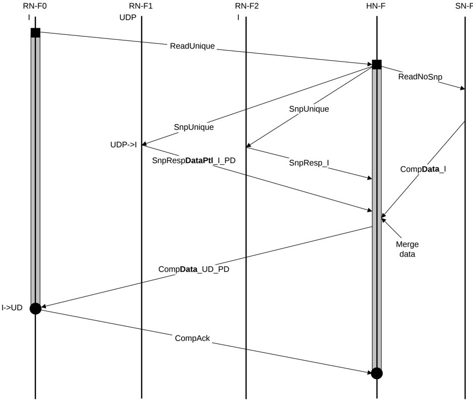

Figure B5.6: ReadUnique with partial data snoop response

The steps in the ReadUnique with partial data snoop response transaction flow in Figure B5.6 are:

1. RN-F0 sends ReadUnique request to HN-F.
2. HN-F sends ReadNoSnp request to SN-F and SnpUnique requests to RN-F1 and RN-F2.
3. RN-F1 transitions the cache line from UDP to I and returns SnpRespDataPtl\_I\_PD to HN-F. RN-F2 returns SnpResp\_I to the HN-F. Meanwhile, the SN-F returns CompData response to HN-F. HN-F merges the data returned from the SN-F with the partial data received from the RN-F1.
4. HN-F sends CompData\_UD\_PD to RN-F0. RN-F0 cache line state transitions from I to UD.
5. RN-F0 issues CompAck response to the HN-F to indicate transaction completion.

### B5.1.6 Read transaction with snoop response with partial data and memory update

An example of this type of flow is a ReadClean transaction.

Figure B5.7 shows the transaction flow, the copy of data being transferred is marked in bold.