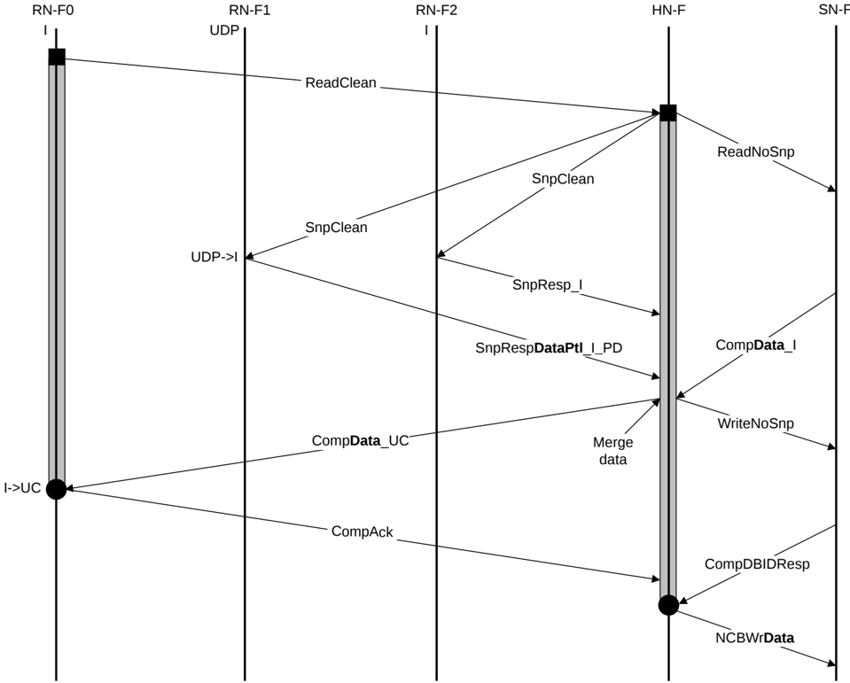

Figure B5.7: ReadClean with partial data snoop response

The steps in the ReadClean with partial data snoop response transaction flow in Figure B5.7 are:

1. RN-F0 sends ReadClean request to HN-F.
2. HN-F sends ReadNoSnp request to SN-F and SnpClean requests to RN-F1 and RN-F2. RN-F1 cache line state transitions from UDP to I.
3. RN-F1 returns SnpRespDataPtl\_I\_PD and RN-F2 returns SnpResp\_I to the HN-F. Meanwhile, the SN-F returns CompData\_I response to HN-F. This merges the data.
4. HN-F sends CompData\_UC to RN-F0 and WriteNoSnp to SN-F. RN-F0 cache line state transitions from I to UC.
5. RN-F0 issues CompAck response to the HN-F to indicate transaction completion.
6. SN-F issues CompDBIDResp to HN-F.
7. HN-F sends NCBWrData to SN-F.