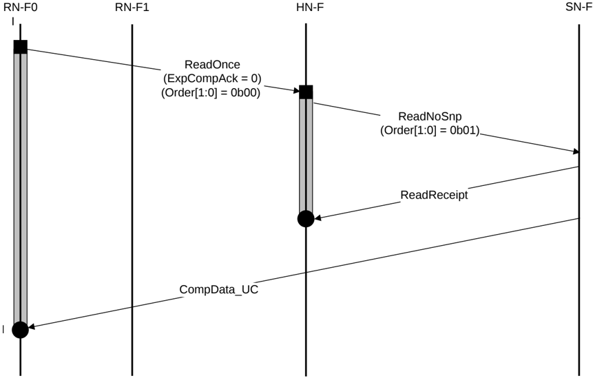

### B5.1.7 ReadOnce* and ReadNoSnp with early Home deallocation

Figure B5.8 shows the optimized flow for an unordered ReadOnce request.

Figure B5.8: DMT optimization for unordered ReadOnce

The steps in the optimized ReadOnce transaction flow in Figure B5.8 are:

1. RN-F0 sends an unordered ReadOnce request to HN-F with Order[1:0] set to 0b00.
2. HN-F sends a DMT ReadNoSnp request to SN-F with the Order[1:0] set to 0b01.
3. SN-F sends ReadReceipt to Home.
4. HN-F deallocates the request after receiving the ReadReceipt response.
5. SN-F sends CompData\_UC directly to RN-F0.

> **_NOTE:_** Use of a ReadNoSnp transaction from Home to Subordinate, in the case where CompAck is not required, avoids the need to send a RespSepData response from Home to Requester.

### B5.1.8 ReadNoSnp transaction with DMT and separate Non-data and Data-only response

Figure B5.9 shows an example DMT transaction flow with separate Non-data and Data-only response.

In this example, there is no ordering requirement and HN-F can deallocate the request once it receives ReadReceipt, without waiting for CompAck from the RN-F.