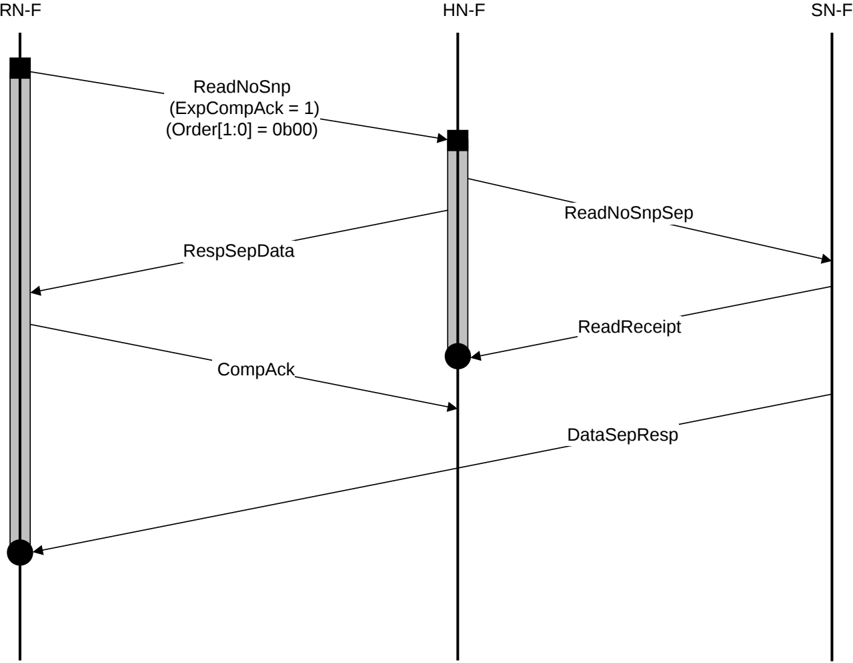

Figure B5.9: DMT Read transaction example with separate Non-data and Data-only

The steps in the ReadNoSnp transaction in Figure B5.9 are:

1. RN-F sends an unordered ReadNoSnp request to HN-F.
2. HN-F sends a ReadNoSnpSep request to SN-F.
3. HN-F sends a RespSepData response to RN-F.
4. SN-F sends a ReadReceipt to HN-F.
5. RN-F sends CompAck after receiving RespSepData.
6. SN-F sends DataSepResp to RN-F returning the read data.

### B5.1.9 ReadNoSnp transaction with DMT with ordering and separate Non-data and Data-only

Figure B5.10 shows an example DMT transaction flow with ordering and separate Non-data and Data-only.

ReadNoSnp with non-zero Order field in Figure B5.10 requires that:

- Next ordered request can be sent only after receiving of RespSepData.
- RN-F must wait for RespSepData and at least one packet of DataSepResp before sending CompAck.
- HN-F must not send next ordered request to SN-F until receiving CompAck.