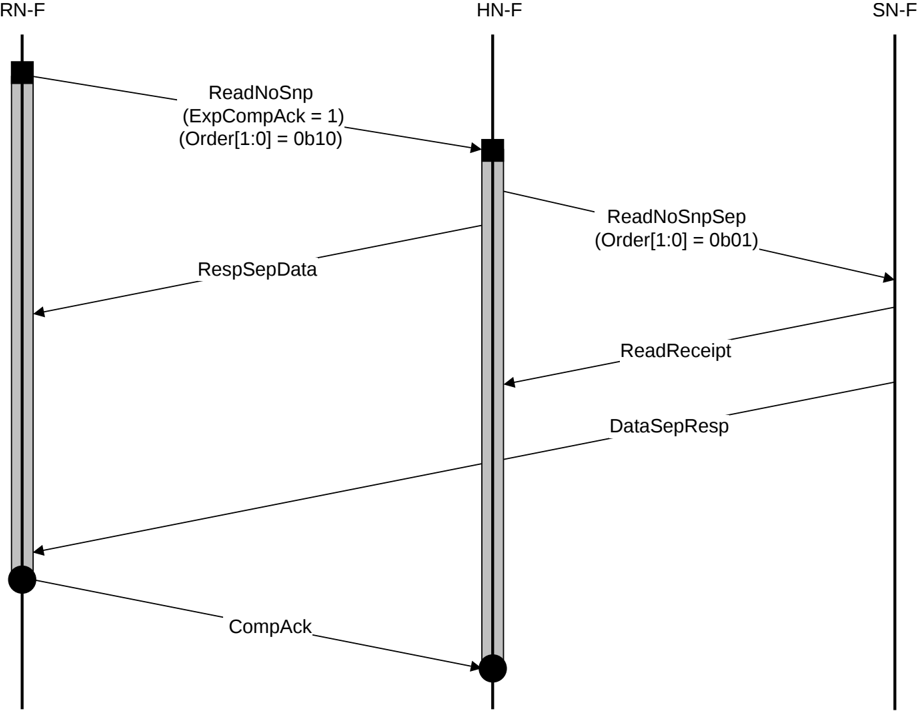

Figure B5.10: DMT Read transaction example with ordering and separate Non-data and Data-only

The steps in the Read transaction with ordering and separate Non-data and Data-only in Figure B5.10 are as follows:

1. RN-F sends ReadNoSnp to HN-F, with ExpCompAck set to 1. Order[1:0] is set to 0b10.
2. HN-F sends ReadNoSnpSep to SN-F with Order[1:0] set to 0b01.
3. HN-F returns RespSepData to RN-F.
4. SN-F returns ReadReceipt to HN-F.
5. SN-F sends DataSepResp to RN-F directly.
6. RN-F issues CompAck to HN-F.