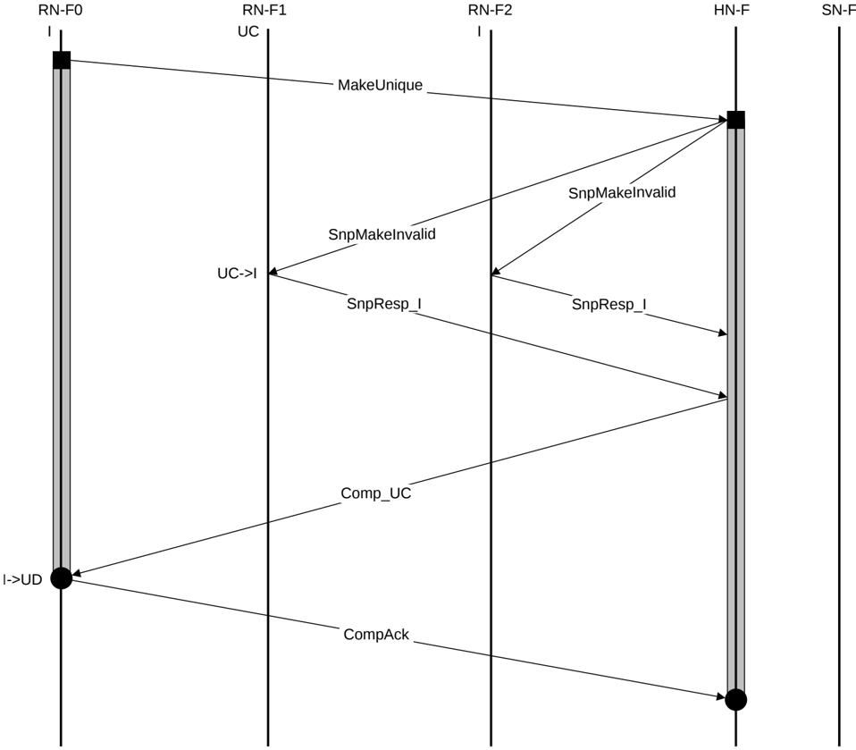

## B5.2 Dataless transaction flows

This section gives examples of the interconnect protocol flow for Dataless transactions.

### B5.2.1 Dataless transaction without memory update

An example of this type of flow is a MakeUnique transaction.

Figure B5.11 shows the transaction flow.

Figure B5.11: MakeUnique without memory update

The steps in the MakeUnique without memory update transaction flow in Figure B5.11 are:

1. RN-F0 sends MakeUnique request to HN-F.
2. HN-F sends SnpMakeInvalid requests to RN-F1 and RN-F2. RN-F1 cache line state transitions from UC to I.
3. RN-F1 and RN-F2 return SnpResp\_I to the HN-F.