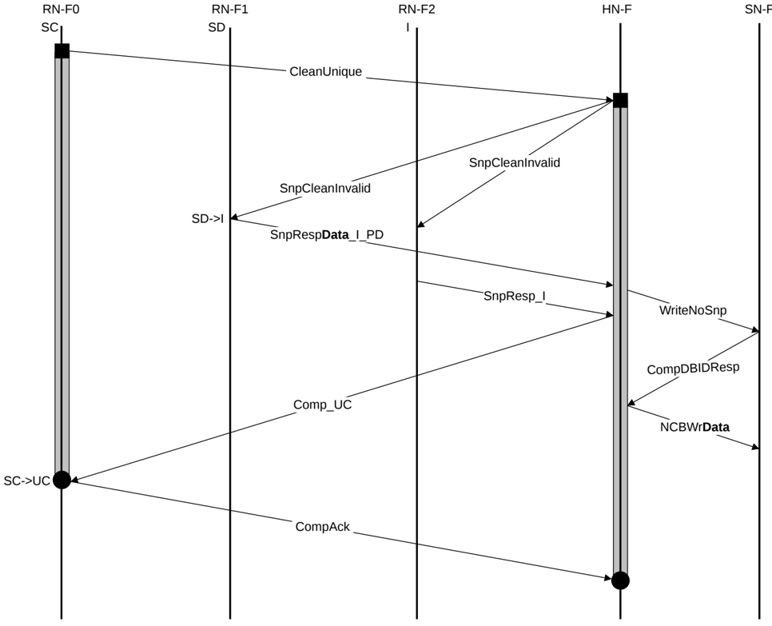

4. HN-F sends Comp\_UC to RN-F0. RN-F0 cache line state transitions from I to UD.
5. RN-F0 issues CompAck response to the HN-F to indicate transaction completion.

### B5.2.2 Dataless transaction with memory update

An example of this type of flow is a CleanUnique transaction.

Figure B5.12 shows the transaction flow.

NCBWrData = NonCopyBackWriteData

The steps in the CleanUnique with memory update transaction flow in Figure B5.12 are:

1. RN-F0 sends CleanUnique request to HN-F.
2. HN-F sends SnpCleanInvalid requests to RN-F1 and RN-F2. RN-F1 cache line state transitions from SD to I.
3. RN-F1 returns SnpRespData\_I\_PD to HN-F. HN-F sends WriteNoSnp to SN-F.