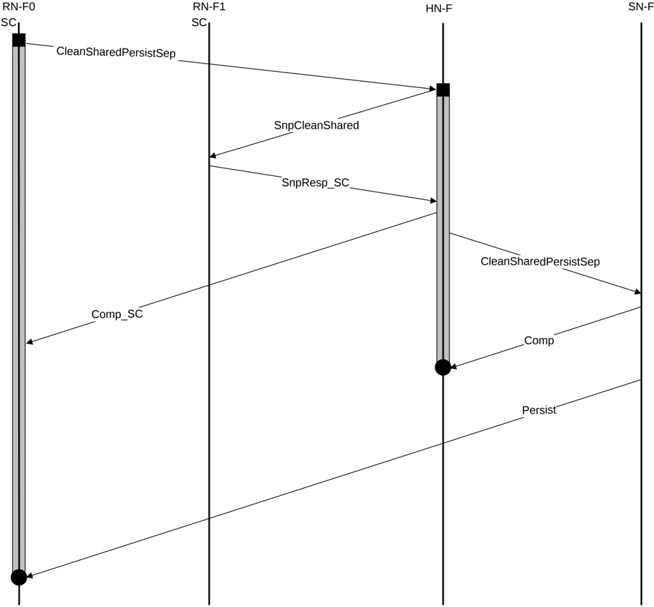

4. RN-F2 returns SnpResp\_I to the HN-F. HN-F can now send Comp\_UC to RN-F0. RN-F0 cache line state transitions from SC to UC. Meanwhile, SN-F returns CompDBIDResp to HN-F. HN-F subsequently sends NCBWrData to SN-F.
5. RN-F0 issues CompAck response to the HN-F to indicate transaction completion.

### B5.2.3 Persistent CMO with snoop and separate Comp and Persist

In this example of CleanSharedPersistSep transaction flow, the Point of Persistence (PoP) is at the SN-F.

Figure B5.13 shows the transaction flow.

Figure B5.13: CleanSharedPersistSep transaction flow

The steps in the CleanSharedPersistSep transaction flow in Figure B5.13 are: