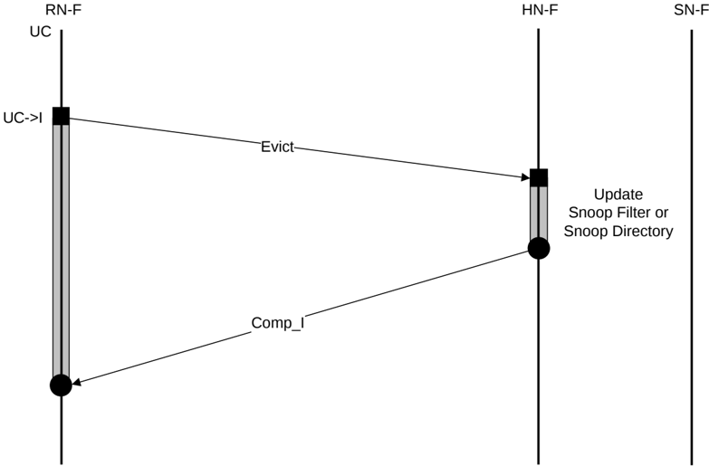

1. RN-F0 sends CleanSharedPersistSep request to HN-F.
2. HN-F sends SnpCleanShared request to RN-F1.
3. RN-F1 sends SnpResp\_SC to HN-F.
4. HN-F sends Comp\_SC to RN-F0.
5. HN-F sends CleanSharedPersistSep to SN-F after completing the writing back of all snooped Dirty data, if any.
6. SN-F returns Comp response to HN-F. SN-F directly sends Persist response to RN-F0 to indicate the request has reached PoP and data from any prior writes to the same location is pushed to PoP.

### B5.2.4 Evict transaction

Figure B5.14 shows the Evict transaction flow.

> **_NOTE:_** The Evict request is a hint. A Comp response can be given by HN-F without updating the Snoop Filter or Snoop Directory.

Figure B5.14: Evict transaction flow

The steps in the Evict transaction flow in Figure B5.14 are:

1. RN-F0 cache line state transitions from UC to I and sends Evict request to HN-F. HN-F receives and allocates the request.
2. HN-F returns Comp\_I response and deallocates the request. RN-F0 deallocates the request.