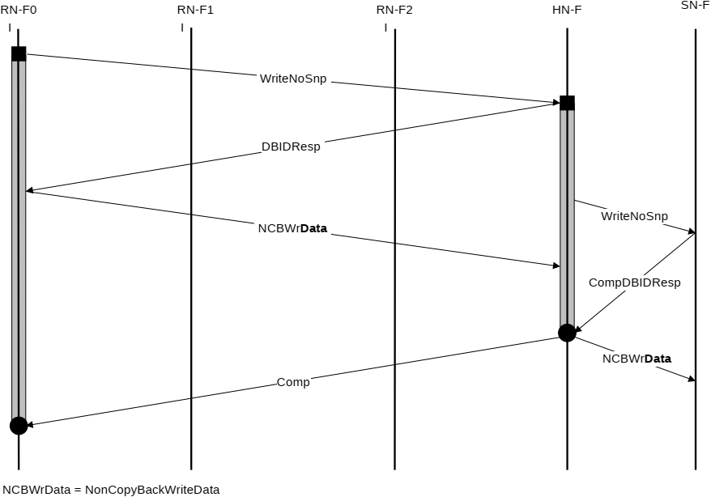

## B5.3 Write transaction flows

This section gives examples of the interconnect protocol flow for Write transactions.

### B5.3.1 Write transaction with no snoop and separate responses

Figure B5.15 shows a WriteNoSnp transaction flow.

The steps in the WriteNoSnp transaction flow in Figure B5.15 are:

1. RN-F0 issues a WriteNoSnp transaction to HN-F. HN-F receives and allocates the request.
2. HN-F sends DBIDResp without Comp. Meanwhile, HN-F sends WriteNoSnp to SN-F.
3. RN-F0 responds with data, NCWrData. SN-F returns CompDBIDResp to HN-F.
4. HN-F sends a Comp after receiving CompDBIDResp from SN-F. HN-F sends NCBWrData to the SN-F.

    > **_NOTE:_** This flow example shows Comp is sent after CompDBIDResp is received from SN-F. However, HN-F is permitted to send Comp anytime after receiving the WriteNoSnp request from RN-F0.