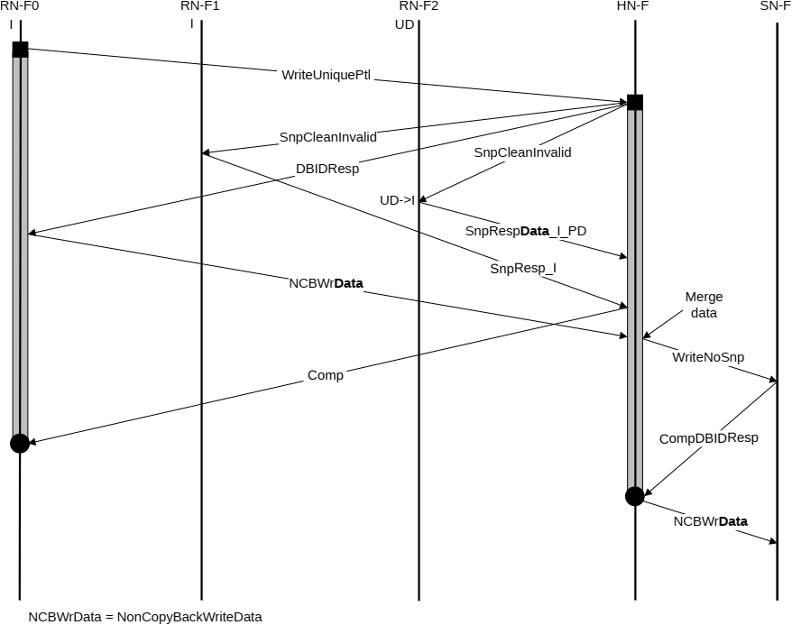

5. RN-F0 waits for Comp from HN-F and deallocates its request.

Figure B5.15 shows the flow, the copy of data being transferred is marked in bold.

### B5.3.2 Write transaction with snoop and separate responses

An example of this type of flow is a WriteUniquePtl transaction.

Figure B5.16 shows the transaction flow. The copy of data being transferred is marked in bold.

The steps in the WriteUniquePtl with snoop transaction flow in Figure B5.16 are:

1. RN-F0 sends WriteUniquePtl request to HN-F.
2. HN-F sends SnpCleanInvalid requests to RN-F1 and RN-F2. HN-F also returns DBIDResp to RN-F0. RN-F2 cache line state transitions from UD to I.
3. RN-F1 sends SnpResp\_I and RN-F2 sends SnpRespData\_I\_PD to HN-F.
4. RN-F0 issues NCBWrData to HN-F. HN-F merges the write data with the dirty line and sends WriteNoSnp to SN-F.