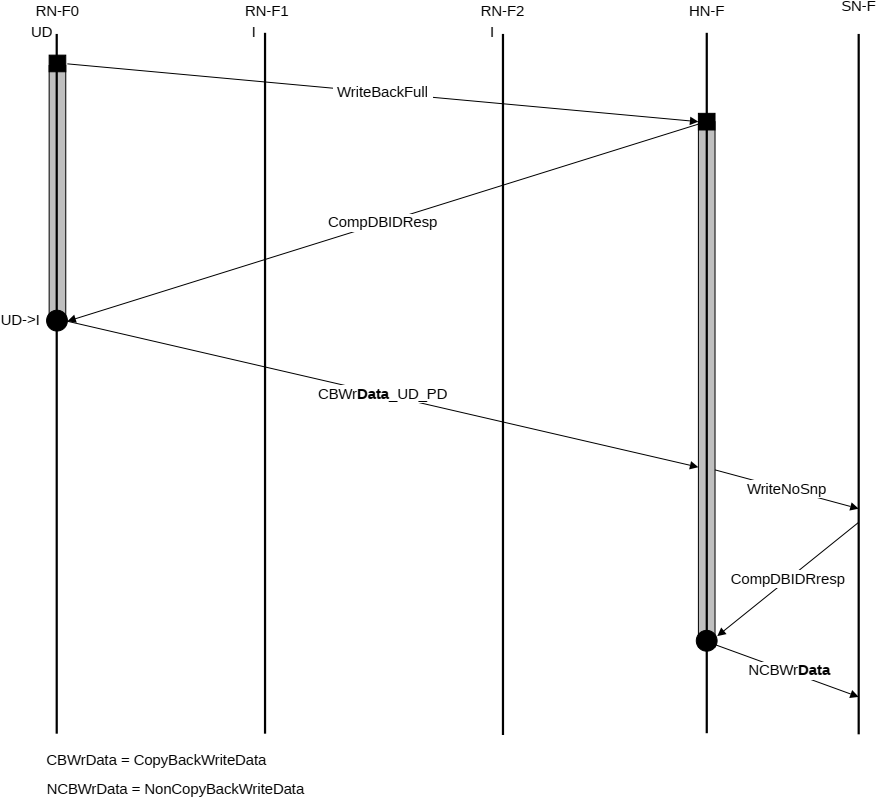

5. HN-F sends Comp response to RN-F0.
6. SN-F returns CompDBIDResp to HN-F.
7. HN-F sends NCBWrData to SN-F.

### B5.3.3 CopyBack Write transaction to memory

An example of this type of flow is a WriteBackFull transaction.

Figure B5.17 shows the transaction flow. The copy of data being transferred is marked in bold.

