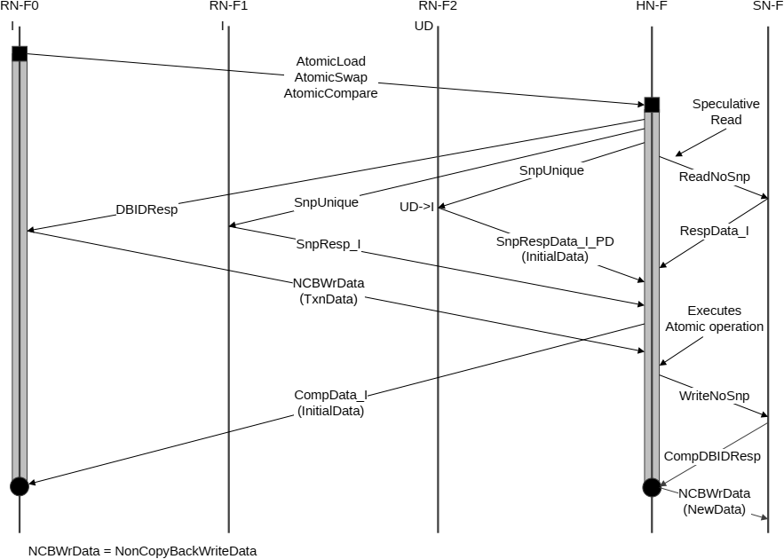

## B5.4 Atomic transaction flows

This section shows flows for different Atomic transaction types. It contains the following subsections:

- B5.4.1 Atomic transactions with data return
- B5.4.2 Atomic transaction without data return
- B5.4.3 Atomic operation executed at the SN

### B5.4.1 Atomic transactions with data return

This flow is applicable to:

- AtomicLoad
- AtomicCompare
- AtomicSwap

#### B5.4.1.1 Atomic transaction with snoops and data return

Figure B5.18 shows the atomic operation executed at HN-F.

