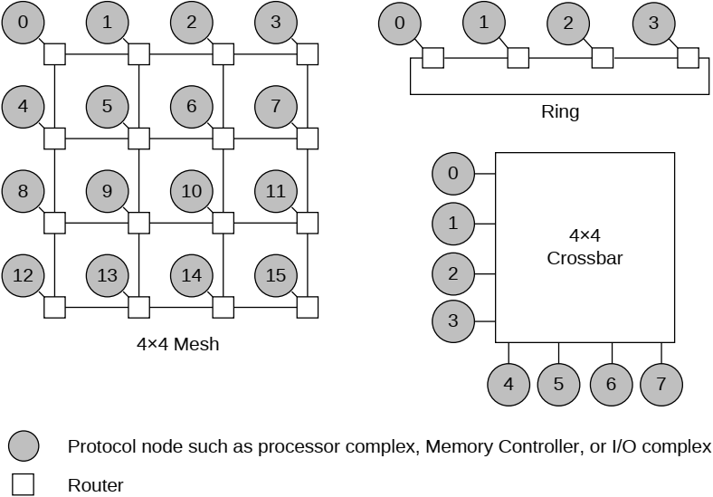

## B1.2 Topology

The CHI architecture is primarily topology-independent. However, certain topology-dependent optimizations are included in this specification to make implementation more efficient. Figure B1.1 shows three examples of topologies selected to show the range of interconnect bandwidth and scalability options that are available.

**Crossbar** Crossbar topology is simple to build and naturally provides an ordered network with low latency. Crossbar topology is suitable where the wire counts are still relatively small. Crossbar topology is suitable for an interconnect with a small number of nodes.

**Ring** Ring topology provides a trade-off between interconnect wiring efficiency and latency. The latency increases linearly with the number of nodes on the ring. Ring topology is suitable for a medium sized interconnect.

**Mesh** Mesh topology provides greater bandwidth at the cost of more wires. Mesh topology is very modular and can be easily scaled to larger systems by adding more rows and columns of switches. Mesh topology is suitable for a larger scale interconnect.