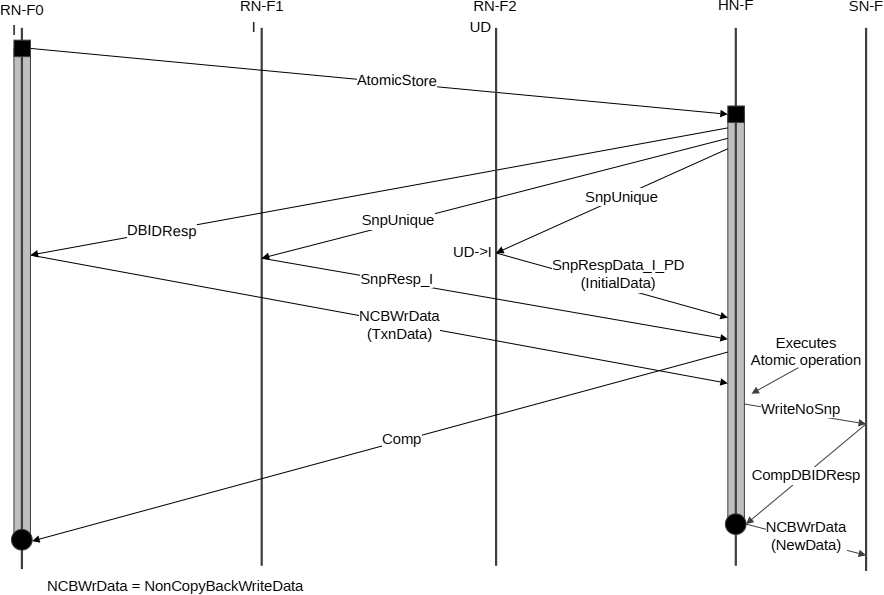

The steps in the Atomic transaction executed at the Home Node transaction flow in Figure B5.19 are:

1. RN-F0 sends Atomic transaction request to HN.
2. HN returns DBIDResp to RN-F0.
3. HN sends ReadNoSnp request to SN. Meanwhile, RN sends NCBWrData (TxnData) to HN.
4. SN returns RespData\_I (InitialData) to HN.
5. HN returns CompData\_I (InitialData).
6. HN executes the Atomic operation and sends WriteNoSnp request to SN.
7. SN returns CompDBIDResp to HN.
8. HN sends the result of the atomic operation to SN, marked as (NewData).

### B5.4.2 Atomic transaction without data return

This flow is applicable to AtomicStore transactions.

#### B5.4.2.1 Atomic transaction with snoops and without data return

Figure B5.20 shows the atomic operation executed at HN-F. The flow is similar to the Atomic transaction with snoop and with data return, except that the Comp response to RN-F0 does not include data.

NCBWrData = NonCopyBackWriteData

The steps in the AtomicStore transaction executed at HN in Figure B5.20 are:

1. RN-F0 sends AtomicStore request to the HN-F.