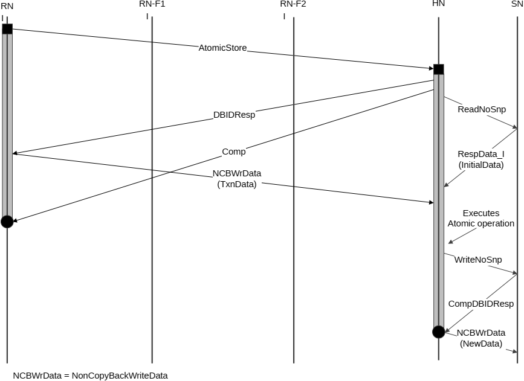

2. HN-F issues DBIDResp to the Requester, RN-F0, and SnpUnique requests to RN-F1 and RN-F2.
3. RN-F1 returns SnpResp\_I response to the HN-F. RN-F2 has the cache line in UD state and returns a SnpRespData\_I\_PD (InitialData) response. This invalidates the cached copy in RN-F2.
4. RN-F0 sends the write data (TxnData) to the HN-F. The HN-F executes the AtomicStore operation locally.
5. HN-F issues a WriteNoSnp request to the SN-F.
6. SN-F returns CompDBIDResp to the Home.
7. HN-F sends the result of the atomic operation to the SN-F, marked as (NewData).

#### B5.4.2.2 Atomic transaction without snoops and without data return

Figure B5.21 shows the atomic operation executed at the Home Node. The flow is similar to the Atomic transaction without snoop and with data return except that the Comp response to the Request Node does not include data.

