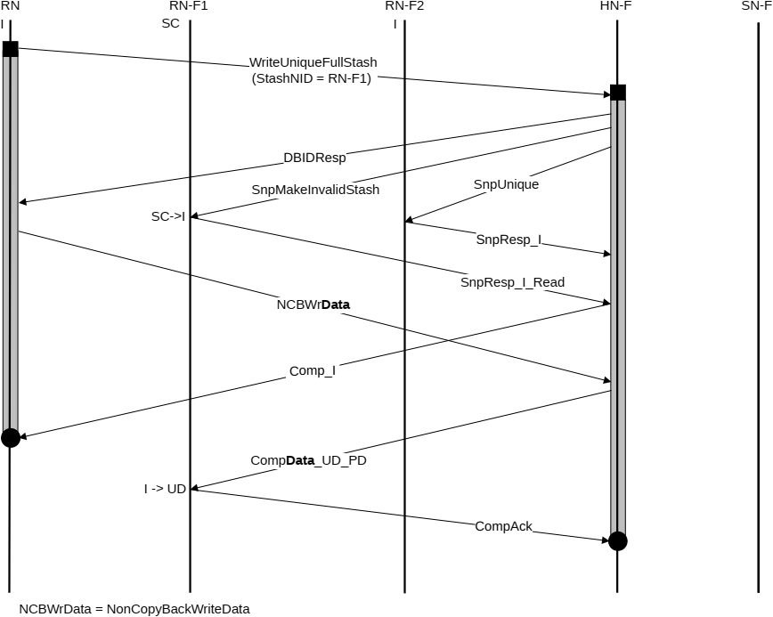

## B5.5 Stash transaction flows

This section shows example interconnect protocol flows for the two Stash transaction types:

B5.5.1 Write with Stash hint
B5.5.2 Independent Stash request

### B5.5.1 Write with Stash hint

Figure B5.23 shows an example WriteUniqueStash with Data Pull transaction flow.

The steps in Figure B5.23 are:

1. The Request Node sends a WriteUniqueFullStash request to HN-F with the Stash target identified as RN-F1. Typically, the requesting Request Node is an RN-I.
2. HN-F sends SnpMakeInvalidStash to RN-F1 and SnpUnique to RN-F2.
3. RN-F1 and RN-F2 send SnpResp response to HN-F. The Snoop response from RN-F1 also includes a Read request, that is, the Data Pull.