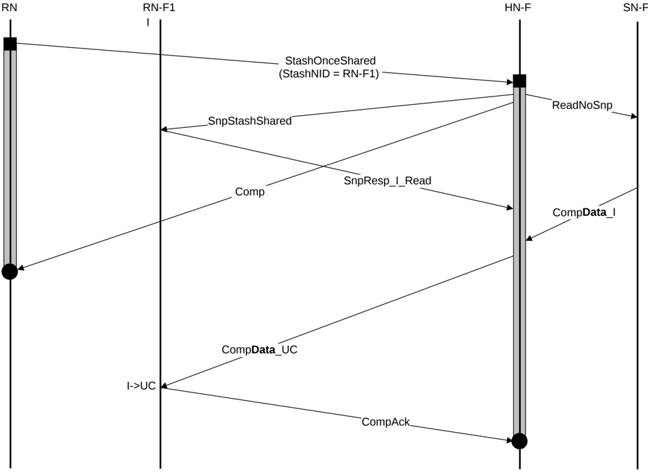

4. HN-F treats the Read request from RN-F1 as a ReadUnique, and sends a combined CompData to RN-F1. CompData response includes the data written by the Request Node.
5. RN-F1 sends CompAck to HN-F to complete the Read transaction.

### B5.5.2 Independent Stash request

Figure B5.24 shows an example StashOnce with Data Pull transaction flow.

Figure B5.24: StashOnceShared with Data Pull

The steps in Figure B5.24 are:

1. The Request Node sends a StashOnceShared request to HN-F with the Stash target identified as RN-F1.
2. HN-F sends a Comp response after establishing processing order for the received request that is guaranteeing the request is processed before a request to the same address received later from any Requester.
3. HN-F sends a SnpStashShared snoop to RN-F1, and a ReadNoSnp request to SN-F to fetch data.
4. RN-F1 sends SnpResp\_I\_Read response to HN-F.
5. HN-F treats the Read request from RN-F1 as a ReadNotSharedDirty, and sends a combined CompData to RN-F1.
6. RN-F1 sends CompAck to HN-F to complete the Read transaction.