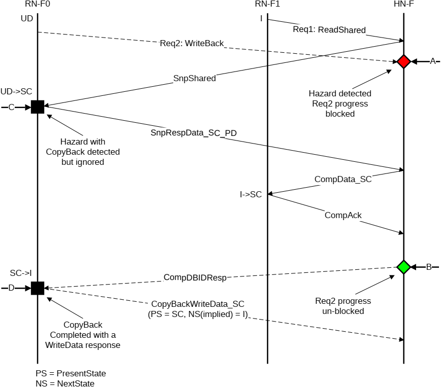

## B5.6 Hazard handling examples

This section shows how CopyBack-Snoop request hazard conditions are handled at the Requester, and how various requests to request and request to snoop request hazard conditions are handled at the HN-F. It contains the following subsections:

- B5.6.1 Snoop request
- B5.6.2 Request
- B5.6.3 Read or Dataless Request
- B5.6.4 Race hazard

### B5.6.1 Snoop request

Figure B5.25 shows a Snoop request to an RN-F hazarding a pending CopyBack request at Time C.

