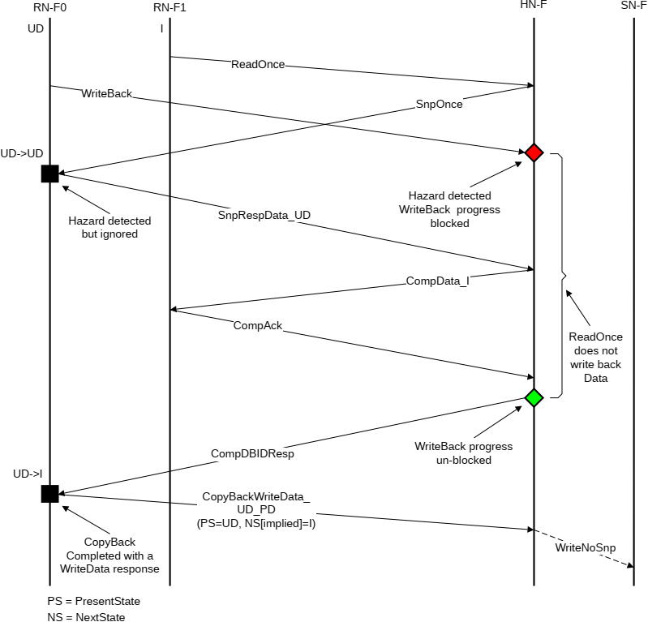

Figure B5.26: CopyBack-Snoop hazard with no cache state change example

### B5.6.2 Request

If more than one request to the same cache line is ready to be processed at the HN-F, the HN-F can select the next request in any order. The exception for this is when the two requests have an ordering requirement and are from the same source, therefore the order of processing must match the order of arrival.

Figure B5.27 shows an example where a ReadShared and a ReadUnique, for the same cache line, arrive at the HN-F at approximately the same time.