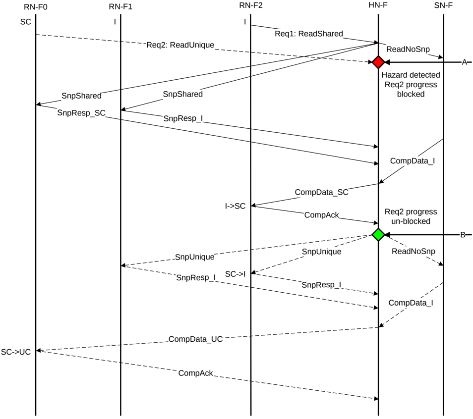

Figure B5.27: Read-Read request hazard example

The steps required to resolve this hazard in Figure B5.27 are:

1. At Time A:

    - ReadUnique from RN-F0 arrives and hazards a ReadShared request from RN-F2 for which the HN-F has already sent Snoop requests.
    - ReadUnique progress is blocked at the HN-F.

2. At Time B:

    - The HN-F has completed the ReadShared transaction request from RN-F2.
    - The ReadShared transaction is considered to be complete and the HN-F unblocks the ReadUnique transaction request from RN-F0.

Except for ReadNoSnp, the flows are similar if the two transactions, that Figure B5.27 shows, are replaced by any Read request type, or Dataless request type: