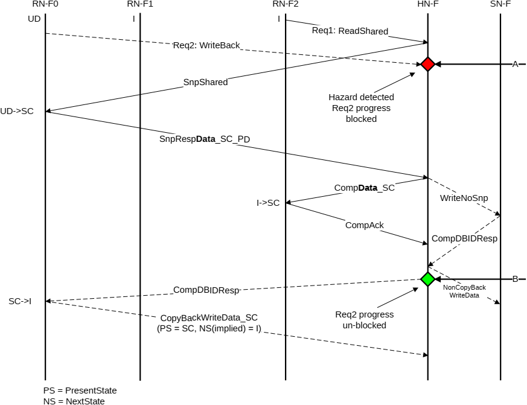

- A Read transaction request without DMT or DCT or separate Comp and data response is completed at the HN-F when both of the following are true:

    - All CompData is sent and, if applicable, CompAck is received. A CompAck is only required for transactions that assert ExpCompAck in the original request message.
    - A memory update is completed if required.

### B5.6.3 Read or Dataless Request

A hazard between a Read or Dataless request and a CopyBack request at the HN-F is treated similarly to the Read-Read hazard described in B5.6.2 Request. See also B5.6.1 Snoop request.

Figure B5.28 shows the case where a ReadShared and a WriteBack, for the same cache line, arrive at the HN-F at approximately the same time.

The steps required to resolve this hazard in Figure B5.28 are:

1. At Time A:

    - A WriteBack encounters a hazarding condition at the HN-F. The reason for the hazard is a ReadShared transaction that is already in progress.