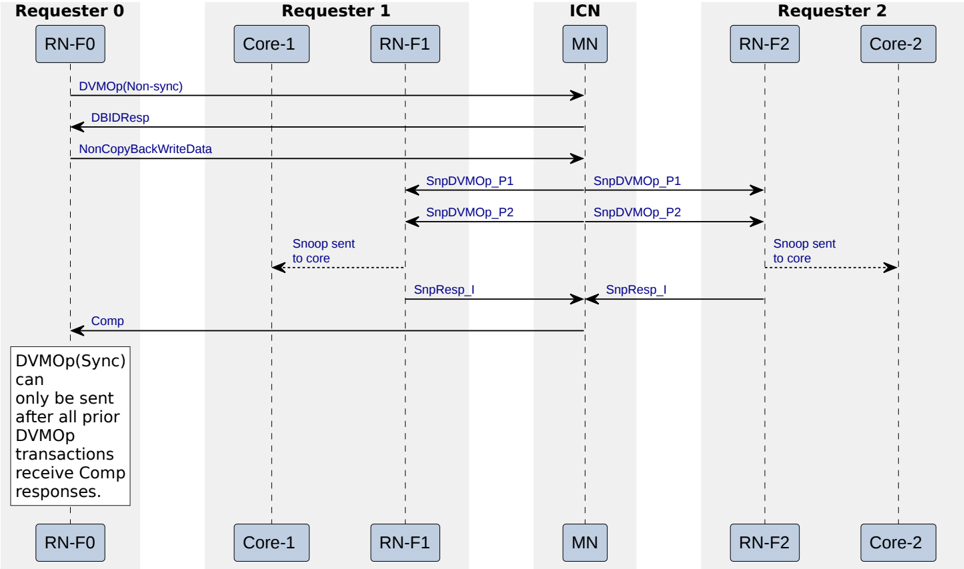

## B8.2 DVM transaction flow

The following sections describe the Non-sync and Sync DVM transaction flows and flow control:

- B8.2.1 Non-sync type DVM transaction flow
- B8.2.2 Sync type DVM transaction flow
- B8.2.3 Flow control

### B8.2.1 Non-sync type DVM transaction flow

Figure B8.1 shows the steps in a Non-sync type DVM transaction.

Figure B8.1: Non-sync type DVM transaction flow

The required steps that Figure B8.1 shows are:

1. RN-F0 sends a DVMOp(Non-sync) to the Miscellaneous Node using the appropriate write semantics for the DVMType.
2. The Miscellaneous Node accepts the DVMOp(Non-sync) request and provides a DBIDResp response.
3. The RN-F0 sends an 8-byte data packet on the data channel.
4. The MN broadcasts the SnpDVMOp snoop request to the remaining RN-F and RN-D nodes in the system. The MN is permitted, but not required, to send the SnpDVMOp to the RN that issued the original DVMOp. The SnpDVMOp is sent on the Snoop channel, and requires two Snoop requests. The two parts of the SnpDVMOp are labeled by the suffix \_P1 and \_P2.